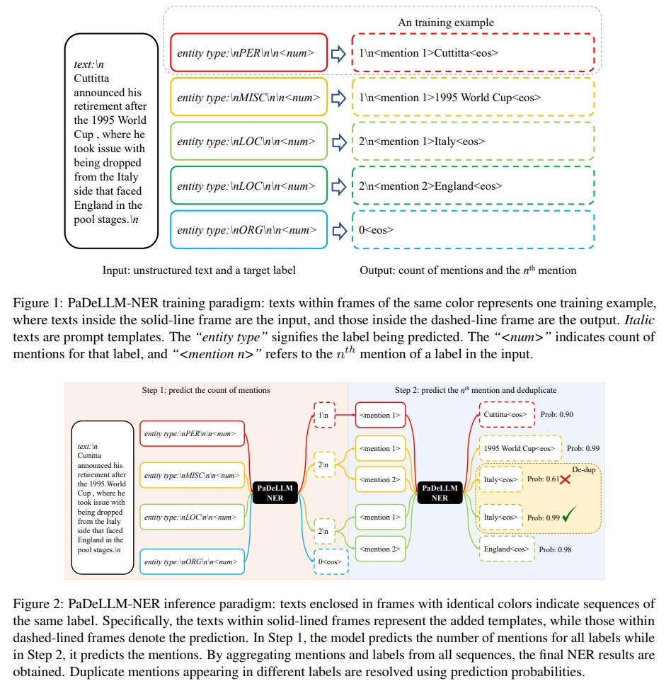
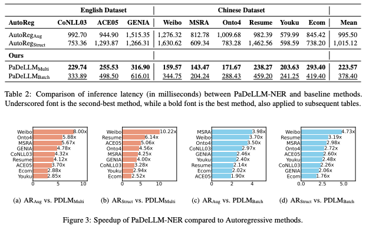

# PaDeLLM-NER: Parallel Decoding in Large Language Models for Named Entity Recognition

This repository is an official implementation based on paper [PaDeLLM-NER: Parallel Decoding in Large Language Models for Named Entity Recognition](https://arxiv.org/abs/2402.04838) 

End2end latency and speedup as compared to autoregressive decoding.

# Dependencies

Tested Python 3.9, and requiring the following packages, which are available via PIP:

* Required: [torch >= 2.1.0](https://pytorch.org/)
* Required: [transformers >= 4.36.2](https://huggingface.co/transformers/)
* Required: [sentencepiece >= 0.1.99](https://huggingface.co/transformers/)

# Datasets
We provide processed datasets used in our paper at the **ner_data** directory, except ACE05 and Ontonotes 4 for copyright reasons.

# Training code and model weights

Since it is easy to re-implement the training procedure based on the paper, we will not provide the training code, instead, we provide the **fine-tuned models** online for replicating purpose.

All model weights are available at https://huggingface.co/JinghuiLuAstronaut

with names **PaDeLLM\_{model}\_{model_size}\_{dataset}**

# Quick start

For English dataset: 

    bash run_conll03_pred_eval_multigpus.sh

    bash run_conll03_pred_eval_single.sh

For Chinese dataset: 

    bash run_weibo_pred_eval_multigpus.sh

    bash run_weibo_pred_eval_singlegpu.sh

Note that run\_{dataset}\_pred\_eval\_multigpus.sh corresponding to PaDeLLM-Multi in the paper, which uses one gpu to simulate batch decoding in multiple gpus.

run\_{dataset}\_pred\_eval\_single.sh corresponding to PaDeLLM-Single in the paper using one gpu parallel decoding all entities (requires large gpu memory in some datasets).
